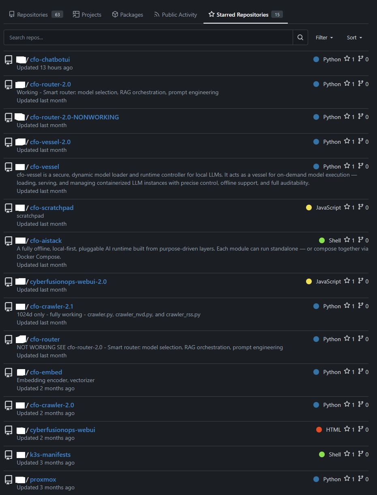

# Project Fong

Welcome - I’m Fong.  

For years I worked behind the scenes as the sole IT department, building and securing infrastructure for regulated environments.  
Now, **Project Fong** is where I bring that discipline into the open - showcasing selected work in AI systems, compliance, and infrastructure.

---

## 🔹 About This Space
- GitHub here is used **only for demos and showcases**.  
- Most repositories are **stripped-down** or **partial releases**.  
- Full projects and production implementations are maintained in a private environment.

> ⚠️ **Disclaimer**  
> All repositories in this GitHub are **demo or showcase projects only**.  
> Full production implementations are maintained privately.

---

## 🔹 Focus Areas
- **AI Systems Architecture**: orchestration, embeddings, retrieval, multi-agent control  
- **Compliance & Security**: CMMC Level 2/NIST 800-171, ITAR/DFARS  
- **Infrastructure & Automation**: hybrid networks, firewalls, virtualization, Terraform/Ansible  
- **Full-Stack Prototyping**: FastAPI, React/TypeScript, containerized deployments  

---

## 🔹 Featured Projects (Public Demos)
- **[cfo-aistack-demo](https://github.com/projectfong/cfo-aistack-demo)** → stripped-down modular AI stack (architecture blueprint; full implementation private, README-only)  
- **[cfo-router-demo](https://github.com/projectfong/cfo-router-demo)** → demo router that acts as the *brain* between users and local AI systems — handles routing, model selection, and policy-based decisions (public-safe echo version)
- **[cfo-vessel-demo](https://github.com/projectfong/cfo-vessel-demo)** → demo LLM engine (Vessel) — exposes a safe inference API with canned responses; full runtime and GPU logic private
- **[cfo-chatbotui-demo](https://github.com/projectfong/cfo-chatbotui-demo)** → finished demo chatbot (React/TypeScript + FastAPI)  

---

## 🔹 Private Gitea Screenshot

Screenshot from local private Gitea repo (sensitive details redacted):

* **Gitea Starred Repositories**

  

>Identifiers redacted; screenshot included to illustrate internal repository organization and version-control discipline.

---

## Lab Environment

All AI runtime and orchestration projects are developed and validated on self-hosted hardware.

| Role | Hardware | GPUs | Purpose |
|------|-----------|------|----------|
| **Compute Node A** | Intel i9-9400F, 32 GiB RAM | 2 × RTX 3070 (8 GiB) | codeproject.ai / embed server |
| **Compute Node B** | AMD Ryzen 7 3700X, 32 GiB RAM | 2 × RTX 3060 (12 GiB) | Primary inference / model-serving node | 
| **Virtualization Host** | Dell PowerEdge R730, 2 × Xeon E5-2690 v4, 384 GiB RAM, Oracle F320 NVMe, Dual 1100w PSU | None | Proxmox VE 9.0.6 – VM orchestration, CI/CD, log aggregation |
| **Storage / Network** | SAS RAID (≈ 22 TB usable), OPNsense | None | VM disks, ZFS pools, datasets, and segmented networking |
| **Backup** | QNAP NAS – 9 TB NFS | None | Proxmox Backup Server for dedicated VM backup |

*All systems are personally owned and maintained for research and R&D use.  
No customer or sensitive data is processed.*

---

## 🔹 Keywords / Related Search

* LLM inference engine, local AI infrastructure  
* RAG pipelines, retrieval-augmented generation  
* embedding management, multi-agent coordination  
* GPU scheduling, llama.cpp, GGUF  
* compliance, policy, prompt governance  
* containerized orchestration, observability hooks  
* React, TypeScript, FastAPI frontend, on-prem deployments

---

## 🔹 Notes
`projectfong` is about **reinvention** — bringing forward the work that was once hidden behind the scenes.  

What you see here are **representations** of larger projects, shared selectively for visibility.  

This GitHub serves as a technical portfolio illustrating architecture, discipline, and experimentation across AI systems and secure infrastructure.

---
